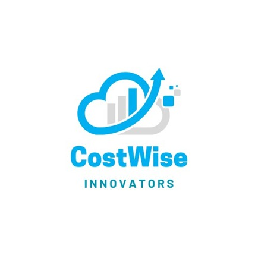

# CostWise Insights Hub



## Overview

CostWise is a comprehensive cost optimization and expense management platform built for businesses of all sizes. It provides detailed insights, analytics, and recommendations to help companies optimize their spending and identify savings opportunities.

## Key Features

- **Interactive Dashboard**: Get a complete overview of your company's expenses with visual representations of cost trends, distributions, and comparisons.
- **Expense Management**: Track, categorize, and analyze expenses across departments and categories.
- **Department Analysis**: View department-specific spending patterns and identify areas for cost optimization.
- **Budget Analysis**: Compare actual expenses with budgeted amounts to maintain financial discipline.
- **Demo Accounts**: Try out the platform with pre-populated data before committing to a subscription.

## Quick Start

Follow these steps to get started with CostWise:

```sh
# Clone the repository
git clone <your-repo-url>

# Navigate to the project directory
cd costwise

# Install dependencies
npm install

# Start the development server
npm run dev
```

## Technology Stack

CostWise is built using modern web technologies:

- **Frontend**: React, TypeScript, Tailwind CSS
- **UI Components**: shadcn/ui
- **Data Visualization**: Recharts
- **State Management**: React Context API and React Query
- **Routing**: React Router
- **API**: Express server with mock data

## Project Structure

The project follows a modular structure for better maintainability:

- `/src/components`: UI components organized by feature
- `/src/contexts`: React contexts for state management
- `/src/hooks`: Custom React hooks
- `/src/layouts`: Page layout components
- `/src/pages`: Application pages and routes
- `/src/services`: API services and data handling
- `/src/types`: TypeScript type definitions
- `/src/utils`: Utility functions

## Deployment

The application can be deployed using Lovable's built-in deployment features:

1. Navigate to your project in Lovable: https://lovable.dev/projects/9318757a-9283-4a26-b65a-f27866e5f8f0
2. Click on "Share" → "Publish"
3. Your application will be deployed and available at the provided URL

For custom domain deployment, see [Custom Domain Documentation](https://docs.lovable.dev/tips-tricks/custom-domain/).

## Demo Access

To experience CostWise without signing up:

1. Visit the homepage
2. Click "Try Demo"
3. Select one of the available demo companies
4. Explore all features with pre-populated data

## Subscription Plans

CostWise offers two main subscription tiers:

- **Standard Plan** ($499/month): Suitable for small to medium businesses with up to 5 departments
- **Enterprise Plan** ($1,299/month): Designed for larger organizations with unlimited departments and advanced features

## Contributing

Contributions are welcome! Please feel free to submit a Pull Request.

## License

This project is proprietary software.

## Contact

For more information, please contact [contact@costwise.com](mailto:contact@costwise.com).
